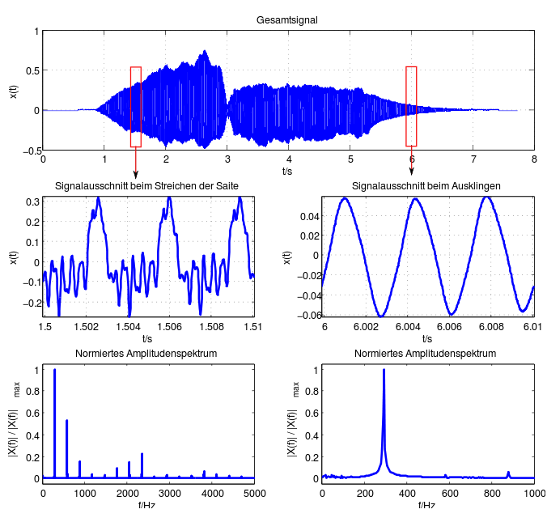
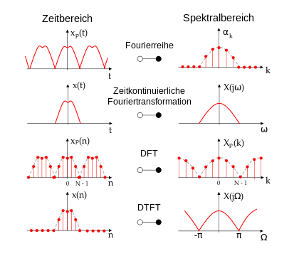

#  Diskrete Fourietransformation 

Implementierung eines Python-Notebooks, das für ein zu ladendes Signal eine diskrete Fourier-Analyse durchführt und anschließend mit Hilfe der Rücktransformation das Ausgangssignal rekonstruiert.

Im Projekt werden sowohl einfache, als auch komplexe Signale mit verschiedenen Implementierungen transformiert und im Anschluss rücktransformiert. Die Differenz zwischen Eingangs-und  und Ausgangssignal wird visualisiert und kann durch verschiedene Tonbeispiele
und Filtereinstellungen wahrgenommen werden.

Das folgende Darstellung des Jupyter Notebooks ist lediglich demonstrativ und nicht funktional. Zum Testen kann das Jupyter Notebook heruntergeladen und gestartet werden.

# Installation

 1. Repository clonen oder im Zip-Format herunterladen
 2. In den Repository-Ordner wechseln
 3. Requirements installieren `pip install -r requirements.txt`
 4. Notebook im Ordner 'Notebook' ausführen

# Jupyter Notebook

Schaut man sich den Schwingungsverlauf eines realen akkustischen Signals an, fällt relativ schnell auf, dass es sich hierbei nicht nur um eine einfache Sinus Schwingung handelt. Betrachtet man beispielsweise den folgenden Geigenton an der ersten rotmarkierten Stellen genauer, lässt sich eine komplexe Schwingung erkennen (vgl.  Abbildung 1 Signalausschnitt beim Streichen einer Geigensaite).

<p align="center">

<p>Abbildung 1 Signalausschnitt beim Streichen einer Geigensaite</p>
</p>

In der Abbildung unter dem Signalausschnitt ist das Spektrum, also die frequentielle Komposition des Signales abgebildet. Dabei lässt sich erkennen dass der Ton nicht nur aus einer einzigen Sinus/Cosinus-Schwingung besteht, sondern sich durch eine Überlagerung verschiedener Frequenzen mit unterschiedlich starken Amplituden zusammensetzt. Bezogen auf die Geige bildet sich der Ton, beim Zupfen der Saite, aus der Grundfrequenz $f_0 = 294HZ$ und den sogenannten Obertönen, welche ganzzahlige Vielfache der Grundfrequenz darstellen. Das genaue Frequenzspektrum hängt von vielen verschiedenen Faktoren ab und ändert sich im Verlauf des Tonbeispiels, was sich auch akkustisch bemerkbar macht. Betrachtet man zum Beispiel die zweite rot markierte Stelle fällt einem auf, dass der Signalausschnitt eher einer Sinusschwingung gleicht. Beim Ausklingen des Tones fallen die Obertöne fast ganz weg und der Ton reduziert sich hauptsächlich auf seine Grundfrequenz. Dies macht sich auch in der Frequenzkomposition bemerkbar. Anstatt einer Überlagerung mehrerer Frequenzen unterschiedlicher Amplitude besteht das Signal hauptsächlich aus einer Frequenz, der Grundfrequenz.

Um die frequentielle Zusammensetzung eines Schwingungssignals zu berechnen greift man auf die Fourier-Analysis zurück, um genau zu sein auf die Fouriertransformation.

```python
from IPython.display import Audio
sound_file = 'files/Geigenton.wav'
Audio(sound_file)
```

https://user-images.githubusercontent.com/64316635/184502004-309219c5-c266-48ef-80f3-4023276177a8.mp4

## Fourier-Analysis

Unter der Fourier-Analysis versteht man im Allgemeinen die Zerlegung und Synthese beliebig komplexer Schwingungen in einfachere Sinus/Cosinus-Schwingungen.

Der dabei wichtigeste Aspekt ist die sogenannte Fouriertransformation, wobei eine Schwingung, meistens aus dem Zeitbereich, in den Spektralbereich transformiert wird. Der Spektralbereich beschreibt die frequentielle Komposition der Schwingungsfunktion. Anhand dieser frequentiellen Signatur lässt sich das Ausgangssignal durch eine Fouriersynthese/inverse Fouriertransformation rekonstruieren

Bei Fouriertransformationen unterscheidet man zwischen der Zerlegung in eine Fourierreihe, der kontinuierlichen Fouriertransformation, der <strong>diskreten Fouriertransformation (DFT) </strong> und Fouriertransformationen für zeitdiskrete Signale (DTFT). Diese Typen unterscheiden sich hauptsächlich in der Kontinuität der Schwingung und der daraus resultierenden Spektralfunktion (vgl. Abbildung 1). Im Folgenden wird die diskrete Fouriertransformation, ihre Bedeutung, Anwendung und Theorie näher erläutert.

<p align="center">

<p>Abbildung 2 Fouriertransformation</p>
</p>


## Diskrete Fouriertransformation (DFT)

### Theorie
Bei der diskreten Fouriertransformation liegt das Aussgangssignal als diskrete Funktion $x(n)$ vor.
Um eine Fouriertransformation durchzuführen gehen wir davon aus, dass alle vorliegenden Sample-Werte genau eine Schwingungsperiode des Ausgangssignals beschreiben.
Desweiteren nehmen wir an, dass die gemessenen Sample-Werte äquidistant vorliegen, also mit einer zeitlich konstanten Samplefrequenz abgetastet wurden.
Das Ergebnis der Transformation ist eine diskret Funktion $c(k)$ aufgetragen über der Frequenz.

Die diskrete Fouriertransformation ist folgendermaßen definiert:

$$c_k = \sum_{n=0}^{n-1} y_n * e^{\frac{-ij2\pi kn}{N}}$$

Dabei fällt realtiv schnell auf, dass die realen Funktionswerte xj mit der komplexen Analysefunktion $e^{\frac{-ij2\pi kn}{N}}$ multipliziert werden. Das führt dazu dass die Ergebnisfunktion $c(k)$ ebenfalls komplex ist.

Mit der eulerschen Formel

$$ e^{iy} = cos(y)+isin(y)$$

lässt sich das komplexe Ergebnis in einen Sinus und Cosinus Anteil zerlgen. Dies bedeutet, dass man für jede Frequenz k eine zugehörige Sinus und Cosinus Schwingung erhält. Der Betrag des komplexen Ausdrucks entspricht hierbei der Amplitude der Schwingungsanteile für die jeweillige Frequenz. Der Phasenwinkel des komplexen Ausdrucks entspricht der x-Achsen Verschiebung der Schwingungsanteile für die jeweillige Frequenz . Damit ist die Amplitude ein Maß dafür mit welchem Faktor die jeweillige Frequenz zur Gesamtschwingung beiträgt.


Da wir bei der diskreten Fouriertransformation nur mit diskreten Werten arbeiten können, kann nicht für jede beliebige Frequenz die dazugehörigen Schwingungsanteile errechnet werden.
Wir sind also auf die Anzahl der diskreten Werte von $x(j)$ beschränkt und können maximal genau so viele Frequenzen berechnen wie Sample-Werte vorliegen. Dazu kommt, dass nach dem Nyquist-Abtasttheorem gilt, dass ein auf $f_{max}$ bandbegrenztes Signal aus einer Folge von äquidistanten Abtastwerten exakt rekonstruiert werden kann, wenn es mit einer Frequenz von größer als $2*f_{max}$ abgetastet wurde.

Gehen wir davon aus, dass unser zu transformierendes Signal $x(j)$ mit einer Samplefrequenz $f_s$ abgetastet wurde, ergibt sich also durch das Nyquist-Abtasttheorem ein Limit von $\frac{f_s}{2}$  bis zu zu dem Frequzanteile in der eigentlichen Schwingung herausgerechnet werden können. Daraus folgt dass aus N Sample Werten nur $\frac{N}{2}$ anteilige Frequenzen bestimmt werden können. Die Auflösung der möglich berechenbaren Frequenzen ergibt sich mit

$$ Frequenzabstand=\frac{f_s}{N}$$ 

Wollen wir also ein kontinuierliches Frequenzspektrum betrachten müsste man N gegen unendlich laufen lassen, was in der Praxis jedoch nicht möglich ist.

##  Einfaches Beispielsignal

Im folgenden Codebeispiel wird die im oberen Abschnitt beschriebene Mathematik in ein Python-Programm übersetzt.
Als diskretes Ausgangssignal nehmen wir eine einfach Sinusschwingung mit der Frequenz $f_0=2Hz$ und einer Amplitude von $a=1cm$.
Diese Sinusschwingung tasten wir mit 50 Samplepunkten über einen Zeitraum von 1s ab, also mit einer Samplingfrequenz von $f_s=50Hz$ ab und speichern das diskrete Signal in dem Array y.

```python
import numpy as np
import matplotlib.pyplot as plt
#Anzahl SamplePunkte
N=100
# MEssbereich
t_start=0
t_ende=2
#Samplingfrequenz
f_s=N/(t_ende-t_start)
# Erstellung der X-Achse
x = np.linspace(t_start,t_ende,N)
#Deklarieren von
y_sin = np.zeros(N)
f=2
for n in range(N):
    y_sin[n]=np.sin((t_ende-t_start)*f*2*np.pi*n/N)
plt.plot(x,y_sin,'k.')
plt.ylabel('Amplitude in cm')
plt.xlabel('Zeit in s')
plt.show()
```

<p align="center">
  
</p>

Im Anschluss wird die Funktion zur Berechnung der diskreten Fouriertransformation definiert.
Dazu wird über alle Frequenzen k iteriert,auch wenn die zweite Hälfte der Frequenzen nach dem  Nyquist-Abtasttheorems unwichtig ist.
Für jede Frequenz k wird der dazu komlpexe Schwingungsterm c[k] berechnet.

```python
def discrete_fourier_transformation(y):
    N=y.size
    c=np.zeros(N,complex)
    n=np.arange(N)
    #Diskrete Transformation mit For-Loops
    for k in range(N):
        c[k]=np.sum(y*np.exp(-2j*np.pi*k*n/N))
    return c
    #print(abs(c))
    #Diskrete Transformation mit Matrix
    #k= np.arange(N)[:,None]
    #c = np.sum(y*np.exp(-2j*np.pi*k*n/N),axis=1)
```
Wendet man nun die diskrete Fouriertransfomation auf das oben erzeugte Sinussiganl an und schneidet die obere Hälfte aufgrund des Nyquist-Limits ab ergibt sich ein Schaubild, dass wie Erwartet zeigt, dass die Sinusfunktion mit der Frequenz $f_0=2Hz$ sich auch wirklich nur aus einer Schwingung mit der Frequenz $f=2Hz$ zusammensetzt. Würde man den Graphen mit dem Faktor $\frac{1}{\frac{N}{2}}$ normieren würde auch die Amplitude $a=1cm$ richtig angezeigt. 

```python
def plot_fourier_data(c,f_s):
    N=c.size
    plt.figure(figsize=(12,4))
    plt.subplot(1,2,1)
    # Es wird nur die Hälfte der Frequenzen geplottet weil die andere Hälfte nach Nyquist unzulässig ist
    x = np.linspace(0,int(f_s/2),int(N/2)+1)
    plt.plot(x,np.imag(c[:int(N/2)+1]), label="Imaginär")
    plt.plot(x,np.real(c[:int(N/2)+1]),label="Real")
    plt.ylabel('Amplitude in cm')
    plt.xlabel('Frequenz in Hz')
    plt.legend()
    plt.subplot(1,2,2)
    if N/2>50:
        plt.plot(x,abs(c[:int(N/2)+1]),"r",label="Betrag")
    else:
        plt.plot(x,abs(c[:int(N/2)+1]),"k.",label="Betrag")
    plt.ylabel('Amplitude in cm')
    plt.xlabel('Frequenz in Hz')
    plt.legend()
    plt.show()
# Berechnung der Fouriertransformation
c_sin=discrete_fourier_transformation(y_sin)
#Ploten der Ergebnisse
plot_fourier_data(c_sin,f_s)
```
<p align="center">
  
</p>

## Inverse Fouriertransformation/Fouriersynthese (IDFT)

Im Folgenden wird aus dem Spektralbereich eine inverse Fouriertransformation durchgeführt.
Dabei wird das Originalsignal aus der Fourierfunktion mit folgender Formel synthetisiert.

$$crück_n = \frac{1}{N} * \sum_{n=0}^{n-1} c * e^{\frac{ij2\pi kn}{N}}$$

Durch eine Überlagerung der komplexen Schwingungsterme ergibt sich somit wieder das Originalsignal.
Wenn ein konstantes Signal transformiert wird und im nachhinein synthetisiert, entsteht sogenanntes weißes Rauschen.
Dieser Fall lässt sich in späteren Abschnitten erzeugen.

```python
def discrete_fourier_synthese(c):
    N=c.size
    c_rück=np.zeros(N,complex)
    k= np.arange(N)
    for n in range(N):
        c_rück[n]=1/N*np.sum(c*np.exp(2j*np.pi*k*n/N))
    return c_rück
```

```python
def plotcomparesignals(y,c_rück,t_start,t_ende):
    N=y.size
    x = np.linspace(t_start,t_ende,N)
    plt.plot(x,np.real(y), label="Originales Signal")
    if N>500:
        plt.plot(x,np.real(c_rück), label="Synthetisiertes Signal")
    else:
        plt.plot(x,np.real(c_rück),"k.", label="Synthetisiertes Signal")
        
    plt.ylabel('Amplitude a in cm')
    plt.xlabel('Zeit t in s')
    plt.legend()
    plt.show()
c_rück_sin=discrete_fourier_synthese(c_sin)
plotcomparesignals(y_sin,c_rück_sin,t_start,t_ende)
```
<p align="center">
  
</p>

## Fehlerrechnung zwischen Originalsignal und synthetisiertem Signal

Zur Berechnug des Fehler zwischen dem synthetisierten Signal und dem Originalsignal wird die Standardabweichung s berechnet.
Es gilt:

$$ s=\sqrt{\sum_{i=0}^{N-1} (crück_n-y_n)^2}$$

```python
def standardabweichung(c_rück,y):
    
    c_rück=np.real(c_rück)
    y, c_rück = np.array(y), np.array(c_rück)
    return np.square(np.subtract(c_rück, y)).mean()

```

### Standardabweichung zwischen Originalsiganl und synthetisiertem Signal

```python
print("Die Standardabweichung des original Signals zum synthetisierten Signal beträgt: "+str(standardabweichung(c_rück_sin,y_sin)))
```
Die Standardabweichung des original Signals zum synthetisierten Signal beträgt: 1.176214079343573e-28

## Testen der DFT mit Cos Signalen
```python
from __future__ import print_function
import time
import numpy as np
import matplotlib.pyplot as plt
from ipywidgets import interact, interactive, fixed, interact_manual
import ipywidgets as widgets

def cosinus(N,f,intervall):
    intervall_start,intervall_ende=intervall
    #Samplingfrequenz
    f_s=N/(t_ende-t_start)
    # Erstellung der X-Achse
    x = np.linspace(t_start,t_ende,N)
    #Deklarieren von
    y_cos = np.zeros(N)
    for n in range(N):
        y_cos[n]=np.cos((t_ende-t_start)*f*2*np.pi*n/N)
    plt.plot(x,y_cos)
    plt.ylabel('Amplitude in cm')
    plt.xlabel('Zeit in s')
    plt.show()
    #DFT
    c_cos=discrete_fourier_transformation(y_cos)
    plot_fourier_data(c_cos,f_s)
    #Intervall festlegen
    #positive Frequenzen eliminieren
    c_cos[0:intervall_start]=0
    c_cos[intervall_ende+1:int(c_cos.size/2)]=0
    #negative Frequenzen eliminieren
    offset=int(c_cos.size/2)
    c_cos[c_cos.size-intervall_start+1:c_cos.size]=0
    c_cos[int(c_cos.size/2):c_cos.size-intervall_ende]=0
    ##########
    
    c_rück_cos=discrete_fourier_synthese(c_cos)
    plotcomparesignals(y_cos,c_rück_cos,t_start,t_ende)
    print("Die Standardabweichung des original Signals zum synthetisierten Signal beträgt: "+str(standardabweichung(c_rück_cos,y_cos)))
# MEssbereich
t_start=0
t_ende=1
#Samplingfrequenz
Sample_Points_slider=widgets.IntSlider(
    value=100,
    min=2,
    max=4000,
    step=1,
    description='Anzahl Samplepoints:',
    disabled=False,
    continuous_update=False,
    orientation='horizontal',
    readout=True,
    readout_format='d'
)
Intervall_slider=intervall=widgets.IntRangeSlider(
    value=[0,f_s],
    min=0,
    max=2056,
    step=1,
    description='Frequenzintervall:',
    disabled=False,
    continuous_update=False,
    orientation='horizontal',
    readout=True,
    readout_format='d',
)
Frequenz_Slider=widgets.IntSlider(
    value=1,
    min=0,
    max=50,
    step=1,
    description='Frequenz in Hz:',
    disabled=False,
    continuous_update=False,
    orientsation='horizontal',
    readout=True,
    readout_format='d'
)
interact(cosinus,N=Sample_Points_slider,f=Frequenz_Slider,intervall=Intervall_slider)
# linking the two sliders to dynamically change the border of the slider on half of the Sample-Points
def on_value_change(change):
    new_Sample_Points_slider = change['new']
    Intervall_slider.max = int(new_Sample_Points_slider/2)
Sample_Points_slider.observe(on_value_change, names='value')
```
<p align="center">
  
</p>


Die Standardabweichung des original Signals zum synthetisierten Signal beträgt: 5.455210080049842e-29

Wenn man die Frequenz des Signals auf 0 Hz stellt, fällt auf, dassbei der Rücktransformation ein spezieller Schwingungsgraph entsteht. Dieses Signal nennt man weißes Rauschen und entsteht bei einer IDFT auf einen konstanten Faktor.

## Testen der DFT mit einem Rechtecksignal
```python
from __future__ import print_function
import numpy as np
import matplotlib.pyplot as plt
from ipywidgets import interact, interactive, fixed, interact_manual
import ipywidgets as widgets

def square(N,f,intervall):
    intervall_start,intervall_ende=intervall
    # Berechnung der Samplingfrequenz
    f_s=N/(t_ende-t_start)
    # Erstellung der X-Achse
    x = np.linspace(t_start,t_ende,N)
    #Deklarieren von
    y_rechteck = np.zeros(N)
    for n in range(N):
        if np.sin((t_ende-t_start)*f*2*np.pi*n/N)>0:
            y_rechteck[n]=1
        else:
            y_rechteck[n]=0
    plt.plot(x,y_rechteck)
    plt.ylabel('Amplitude in cm')
    plt.xlabel('Zeit in s')
    plt.show()
    #DFT
    c_rechteck=discrete_fourier_transformation(y_rechteck)
    # Plotten der Ergebnisse
    plot_fourier_data(c_rechteck,f_s)
    
    #Intervall festlegen
    #positive Frequenzen eliminieren
    c_rechteck[0:intervall_start]=0
    c_rechteck[intervall_ende+1:int(c_rechteck.size/2)]=0
    #negative Frequenzen eliminieren
    offset=int(c_rechteck.size/2)
    c_rechteck[c_rechteck.size-intervall_start+1:c_rechteck.size]=0
    c_rechteck[int(c_rechteck.size/2):c_rechteck.size-intervall_ende]=0
    ##########
    
    #IDFT
    c_rück_rechteck=discrete_fourier_synthese(c_rechteck)
    # Plotten der Ergebnisse
    plotcomparesignals(y_rechteck,c_rück_rechteck,t_start,t_ende)
    # Fehler berechnen
    print("Die Standardabweichung des original Signals zum synthetisierten Signal beträgt: "+str(standardabweichung(c_rück_rechteck,y_rechteck)))

# MEssbereich
t_start=0
t_ende=1
#Samplingfrequenz
Sample_Points_slider=widgets.IntSlider(
    value=4000,
    min=2,
    max=4000,
    step=1,
    description='Anzahl Samplepoints:',
    disabled=False,
    continuous_update=False,
    orientation='horizontal',
    readout=True,
    readout_format='d'
)
Intervall_slider=intervall=widgets.IntRangeSlider(
    value=[0,8],
    min=0,
    max=2000,
    step=1,
    description='Frequenzintervall:',
    disabled=False,
    continuous_update=False,
    orientation='horizontal',
    readout=True,
    readout_format='d',
)
Frequenz_Slider=widgets.IntSlider(
    value=1,
    min=0,
    max=50,
    step=1,
    description='Frequenz in Hz:',
    disabled=False,
    continuous_update=False,
    orientsation='horizontal',
    readout=True,
    readout_format='d'
)
interact(square,N=Sample_Points_slider,f=Frequenz_Slider,intervall=Intervall_slider)
plt.tight_layout()
# linking the two sliders to dynamically change the border of the slider
# linking the two sliders to dynamically change the border of the slider on half of the Sample-Points
def on_value_change(change):
    new_Sample_Points_slider = change['new']
    Intervall_slider.max = int(new_Sample_Points_slider/2)
Sample_Points_slider.observe(on_value_change, names='value')
```

<p align="center">
  
</p>

Die Standardabweichung des original Signals zum synthetisierten Signal beträgt: 0.012600394253636267

## Komplexes Tonsignal

Im folgenden Abschnitt werden wir die DFT auf ein komplexes, reales Tonsignal anwenden.
Das vorliegende Testsignal hat folgende Daten:

1. Auflösung pro Sample-Wert: 16bit
2. Audiokanäle: mono
3. Samplefrequenz: 16000 Hz
4. Länge: 1s

In der Informatik hat sich eine Sample-Frequenz von 44100 Hz durchgesetzt. Wenn wir an dieser Stelle noch einmal das Nyquist-Abtasttheorem betrachten, fällt auch auf warum. Das menschliche Ohr kann Frequenzen zwischen 20 und 20 000 Hz erfassen. Ein mit 44100 Hz gesampeltes Signal lässt sich nach der oben beschriebenen Mathematik in 21500 Frequenzen zerlegen, was im Groben unserem Hörspektrum entspricht. Zur diskreten Fouriertransformation wird dazu der FFT (Fast Fourier Transform) Algorithmus benutzt. Der oben implementierte Algorithmus besitzt eine Komplexität von $=O(n^n)$, wohingegen der FFT Algorithmus eine Komplexität von $O(n*log(n))$ besitzt. Im Folgenden wird daher ein Tonsignal verwendet, welches mit ausschlieslich $f_s=16000 Hz$ gesampelt wurde. Selbst bei diesem Signal benötigt der Rechner mehrere Sekunden zum Durchführen des Algorithmus

```python
from scipy.io import wavfile
import scipy.io
from IPython.display import Audio
import numpy as np
import matplotlib.pyplot as plt
#Abspielen der Audiodatei
sound_file = 'files/Geigenton_small_16000.wav'
display(Audio(sound_file))
```

https://user-images.githubusercontent.com/64316635/184501865-7b241804-bece-450c-8d69-45920fd32891.mp4


```python
#Auslesen der Audiodatei
sound_file = 'files/Geigenton_small_16000.wav'
f_s, y_geige = wavfile.read(sound_file)
length=y_geige.size/f_s
x = np.linspace(0., length, y_geige.size)
plt.plot(x, y_geige)
plt.xlabel("Time t in s")
plt.ylabel("Amplitude")
plt.show()
#DFT
c_geige=discrete_fourier_transformation(y_geige)
plot_fourier_data(c_geige,f_s)
print(c_geige[1500])
#IDFT
c_rück_geige=discrete_fourier_synthese(c_geige)
plotcomparesignals(y_geige,c_rück_geige,0,length)
print("Die Standardabweichung des original Signals zum synthetisierten Signal beträgt: "+str(standardabweichung(c_rück_geige,y_geige)))
```
<strong>Im Vergleich dazu den FFT-Algorithmus auf das gleiche Signal. Die Ausführzeit ist um ein vielfaches geringer!</strong>

```python
import scipy.fft
sound_file = 'files/Geigenton_small_16000.wav'
f_s, y_geige = wavfile.read(sound_file)
length=y_geige.size/f_s
x = np.linspace(0., length, y_geige.size)
plt.plot(x, y_geige)
plt.xlabel("Time t in s")
plt.ylabel("Amplitude")
plt.show()
c_geige=scipy.fft.fft(y_geige)
print(c_geige[1500])
plot_fourier_data(c_geige,f_s)
c_rück_geige=scipy.fft.ifft(c_geige)
plotcomparesignals(y_geige,c_rück_geige,0,length)
print("Die Standardabweichung des original Signals zum synthetisierten Signal beträgt: "+str(standardabweichung(c_rück_geige,y_geige)))
```

<p align="center">
  
</p>

Die Standardabweichung des original Signals zum synthetisierten Signal beträgt: 2.0102026232882622e-16

## Kleiner Tonausschnitt

Im Folgenden wird das komplexe Tonsignal von oben noch einmal genauer betrachtet. Wir betrachten einen kleineren Auschnitt und untersuchen welche Auswirkungen die Anzahl an Samplepoints auf die Genauigkeit des Signals hat.
Wir wissen, dass das Signal 16000 Sample-Points besitzt und betrachten im Folgenden nur $\frac{1}{160}$, also 100 Sample-Points davon.

```python
import numpy as np
import matplotlib.pyplot as plt
sound_file = 'files/Geigenton_small_16000.wav'
f_s, y_geige = wavfile.read(sound_file)
# Auslesen von 100 Sample-Points
y_geige=y_geige[0:100]
length=y_geige.size/f_s
x = np.linspace(0., length, y_geige.size)
plt.plot(x, y_geige)
plt.xlabel("Time t in s")
plt.ylabel("Amplitude")
plt.show()
c_geige=scipy.fft.fft(y_geige)
plot_fourier_data(c_geige,f_s)
c_rück_geige=scipy.fft.ifft(c_geige)
plotcomparesignals(y_geige,c_rück_geige,0,length)
print("Die Standardabweichung des original Signals zum synthetisierten Signal beträgt: "+str(standardabweichung(c_rück_geige,y_geige)))
```

<p align="center">
  
</p>

Die Standardabweichung des original Signals zum synthetisierten Signal beträgt: 4.786527138398841e-26

## Frequenzintervalle beim Synthetisieren

Bisher haben wir alle IDFT mit allen vorliegenden Frequenzen durchgeführt. Im Folgenden wollen wir die IDFT auf einen gewissen Bereich beschränken. Dazu laden wir uns den gleichen Geigentestton wie im vorherigen Abschnitt, jedoch mit einer Samplefrequenz von $f_s=44100Hz$ Bei der Rücktransformation suchen wir uns einen Frequenzbereich in dem vorliegenden Spektrum aus und synthetisieren nur in diesem Intervall das Signal. Über den Schieberegler kann in 
einem laufenden Jupyter Notebook das Intervall dynamisch angepasst werden

```python
from __future__ import print_function
import numpy as np
import matplotlib.pyplot as plt
from ipywidgets import interact, interactive, fixed, interact_manual
import ipywidgets as widgets
import scipy.fft
from scipy.io.wavfile import write, read
from IPython.display import Audio

def intervall_idft(intervall):
    intervall_start,intervall_ende=intervall
    x = np.linspace(0., length, y_geige.size)
    plt.plot(x, y_geige)
    plt.xlabel("Time t in s")
    plt.ylabel("Amplitude")
    plt.show()
    # DFT umd Frequenzplot zu generieren
    c_geige=scipy.fft.fft(y_geige)
    plot_fourier_data(c_geige,f_s)
    #Intervall festlegen
    #positive Frequenzen eliminieren
    c_geige[0:intervall_start]=0
    c_geige[intervall_ende+1:int(c_geige.size/2)]=0
    #negative Frequenzen eliminieren
    offset=int(c_geige.size/2)
    c_geige[c_geige.size-intervall_start+1:c_geige.size]=0
    c_geige[int(c_geige.size/2):c_geige.size-intervall_ende]=0
    ##########
    c_rück_geige=scipy.fft.ifft(c_geige)
    plotcomparesignals(y_geige,c_rück_geige,0,length)
    scaled = np.int16(np.real(c_rück_geige)/np.max(np.abs(np.real(c_rück_geige)))*32767)
    write('files/own_intervall.wav', c_rück_geige.size, scaled)
    print("Das synthetisierte Signale zum anhören:")
    display(Audio('files/own_intervall.wav'))
    print("Zum Vergleich das Originalsignal")
    display(Audio('files/Geigenton_small_44100.wav'))
    print("Die Standardabweichung des original Signals zum synthetisierten Signal beträgt: "+str(standardabweichung(c_rück_geige,y_geige)))
    
sound_file = 'files/Geigenton_small_44100.wav'
f_s, y_geige = read(sound_file)
f_s=44100
length=y_geige.size/f_s
interact(intervall_idft,intervall=widgets.IntRangeSlider(
    value=[0, 44100],
    min=0,
    max=22050,
    step=1,
    description='Frequenzintervall:',
    disabled=False,
    continuous_update=False,
    orientation='horizontal',
    readout=True,
    readout_format='d',
))
```

<p align="center">
  
</p>

Das synthetisierte Signale zum anhören:

https://user-images.githubusercontent.com/64316635/184502126-6a760fde-d921-4d89-9ecd-3902807f7cfa.mp4


Zum Vergleich das Originalsignal:

https://user-images.githubusercontent.com/64316635/184502142-e93d75ad-f97e-4d7d-9985-08b7beef1bc4.mp4


Es fällt auf, dass wenn man das Samplefrequenzintervall zu klein macht, sich der Ton akkustisch wahrnehmbar verändert. Die obere Grenze des Intervalls lässt sich jedoch bis auf 8khz herunter drücken, ohne hörbare akkustische Änderungen wahrzunehmen.
Dies liegt an der menschlichen Hörschwelle von ungefähr 16000 Hz (Erwachsener). 

# Anmerkungen
  
  Ausführung in Visual Studio Code kann womöglich zu Fehlern führen:
  issue: https://github.com/microsoft/vscode-jupyter/issues/1012
 
